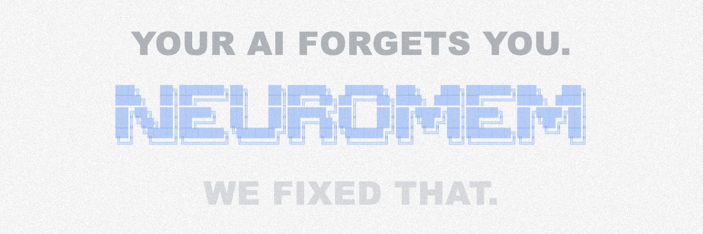
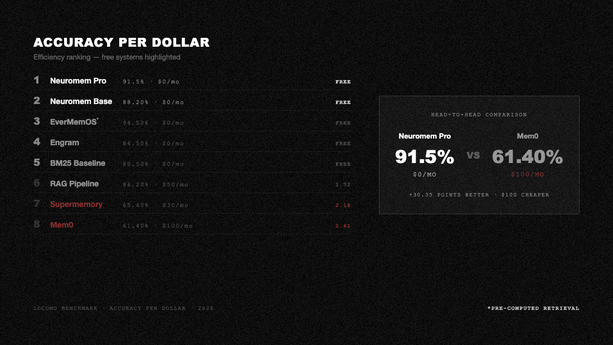
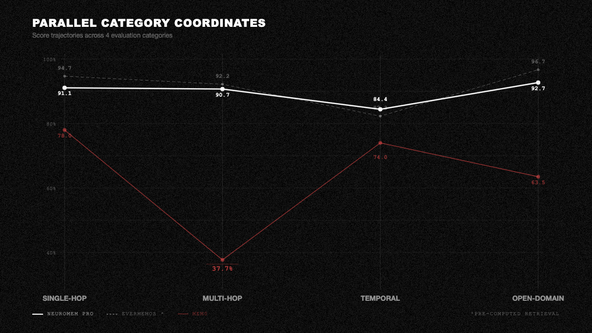

<p align="center">
  
</p>

<p align="center">
  One SQLite file. Zero cloud. Ten minutes to set up.
</p>

<p align="center">
  <a href="https://pypi.org/project/neuromem-core/"></a>
  <a href="https://pypi.org/project/neuromem-core/"></a>
  <a href="https://github.com/buildingjoshbetter/neuromem/blob/main/LICENSE"></a>
  
  
</p>

<p align="center">
  <strong>🏆 91.5% on LoCoMo · 📦 One SQLite File · ☁️ Zero Cloud · 💰 Zero Infrastructure Cost</strong>
</p>

<p align="center">
  <a href="#-benchmark">Benchmark</a> · <a href="#-research-highlights">Highlights</a> · <a href="#-base-vs-pro">Base vs Pro</a> · <a href="#-quickstart">Install</a> · <a href="#-claude-integration">Claude</a> · <a href="#-api">API</a>
</p>

---

## 🔬 Benchmark

Tested on [LoCoMo](https://github.com/snap-research/locomo), the standard benchmark for conversational memory. 1,540 questions across 10 conversations. All 8 systems share the same answer model, judge, scoring, top-k, and byte-identical answer prompt — only retrieval differs.

<p align="center">
  
</p>

Neuromem achieves **state-of-the-art accuracy for fully-local memory systems** at zero ongoing infrastructure cost. Base runs entirely offline with no API keys. Pro adds one small LLM call per query for HyDE query expansion.

<p align="center">
  
</p>

All scores use the same evaluation pipeline: GPT-4.1-mini answer generation, GPT-4o-mini judge (3x majority vote), temperature=0. Zero errors across 12,320 total answers. Scores use a lenient semantic-match judge; rankings are valid across all systems but absolute values are higher than published LoCoMo baselines using strict exact-match. [Full methodology](benchmarks/locomo/BENCHMARK_RESULTS.md) and reproduction scripts in [`benchmarks/`](benchmarks/locomo/).

---

## ⚡ Research Highlights

- **30+ percentage points more accurate than Mem0** on LoCoMo (91.5% vs 61.4%)
- **2x more cost-efficient** per correct answer than Mem0
- **Runs offline** on any device with Python 3.10+ and 512MB RAM
- **One SQLite file, zero API keys.** The entire 6-layer system runs offline.
- **Within 3.0pp of EverMemOS**, the only higher-scoring system — and EverMemOS uses pre-computed retrieval rather than live search at query time.

<p align="center">
  
</p>

Neuromem Pro nearly matches EverMemOS across all 4 question categories. Mem0 collapses on multi-hop reasoning (37.7% vs 90.7%).

---

## 🏗️ Base vs Pro

Same features, same 6-layer pipeline. **Pro upgrades the embedding model and the cross-encoder reranker** for higher retrieval accuracy.

| | Base | Pro |
|---|------|-----|
| **LoCoMo** | 88.2% | 91.5% |
| **Runs on** | Any machine (CPU only) | 4GB+ RAM (CPU or GPU) |
| **First install** | ~30MB | ~1.5GB one-time download |
| **Speed** | Ultra-fast | Fast |

**Base** works everywhere. **Pro** remembers better.

---

## 🚀 Quickstart

### Base

```bash
pip install neuromem-core
```

### Pro

```bash
pip install neuromem-core[gpu]
```

### Usage

```python
from neuromem import Memory

m = Memory()
m.add("Prefers dark mode and TypeScript", user_id="alex")
m.add("Allergic to peanuts", user_id="alex")

results = m.search("What are Alex's preferences?", user_id="alex")
print(results[0]["content"])
# → "Prefers dark mode and TypeScript"
```

The database is created automatically at `~/.neuromem/memories.db`.

---

## 🤖 Claude Integration

Claude forgets you between sessions. Neuromem fixes that.

### 1. Install with MCP support

**Base:**
```bash
pip install neuromem-core[mcp]
```

**Pro:**
```bash
pip install neuromem-core[gpu,mcp]
```

### 2. Add to your Claude config

**Claude Code**: add to `~/.claude.json` under `"mcpServers"`:

```json
{
  "mcpServers": {
    "neuromem": {
      "command": "python",
      "args": ["-m", "neuromem.mcp_server"],
      "env": {}
    }
  }
}
```

**Claude Desktop**: add to `claude_desktop_config.json` (Settings > Developer > Edit Config), same format.

> If you installed in a virtualenv, use the full path to that Python (e.g. `"/path/to/venv/bin/python"`) instead of `"python"`.

Neuromem starts in **Base** mode by default. On your first session, Claude will ask if you'd like to upgrade to **Pro**. You can switch at any time. Your existing memories are automatically re-embedded.

### 3. Make it automatic

Copy [`CLAUDE.md.example`](CLAUDE.md.example) to your project root or home directory as `CLAUDE.md`. This tells Claude to automatically store your preferences and recall them without being asked.

```bash
cp CLAUDE.md.example ~/CLAUDE.md
```

### 4. Test it

Start a new Claude session:
- Say *"I always prefer dark mode"*. Claude stores it automatically.
- Open another session and ask *"What are my preferences?"*. It remembers.

---

## 📖 API

| Method | What it does |
|--------|-------------|
| `m.add(content, user_id=None)` | Store a memory |
| `m.search(query, user_id=None, limit=10)` | Search memories |
| `m.search_deep(query, user_id=None, limit=10)` | Agentic multi-round search (higher latency + LLM cost; best for ambiguous queries) |
| `m.get(memory_id)` | Get one memory |
| `m.get_all(user_id=None, limit=100)` | List all memories |
| `m.update(memory_id, content)` | Update a memory |
| `m.delete(memory_id)` | Delete a memory |
| `m.delete_all(user_id=None)` | Delete all |

---

## 📊 Full Benchmark Details

Every benchmark script is self-contained and runs on [Modal](https://modal.com).

- **[Leaderboard & Reproduction](benchmarks/locomo/README.md)**: run any system yourself
- **[Full Technical Report](benchmarks/locomo/BENCHMARK_RESULTS.md)**: per-category breakdowns, latency, cost, hardware
- **[Evaluation Config](benchmarks/locomo/EVAL_CONFIG.md)**: exact models, prompts, parameters

---

## 📝 Citation

```bibtex
@software{neuromem2026,
  title = {Neuromem: State-of-the-Art Local-First Agent Memory},
  author = {@Building\_Josh},
  organization = {Sauron},
  year = {2026},
  url = {https://github.com/buildingjoshbetter/neuromem},
  version = {0.2.0}
}
```

---

## ⚖️ License

Licensed under [Apache 2.0](LICENSE). Free for personal and commercial use.
